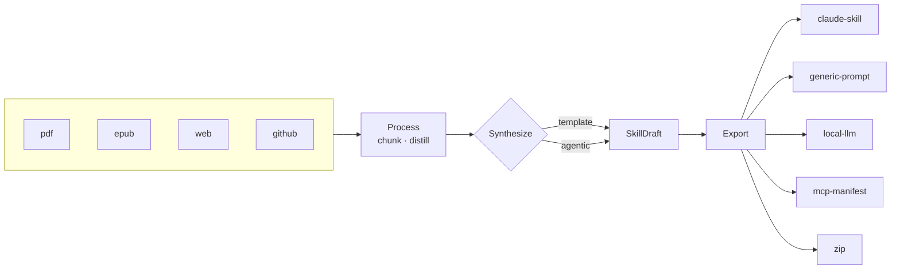

# The Architect's View

Aptitude is about 1,371 lines of Python. It runs against five LLM providers, writes five export formats, and offers two synthesis strategies. Those numbers multiply: fifty working combinations. `--provider gemini --synth agentic --format zip` works. Nobody wrote that path, and no test covers that particular triple. It works because it is not a path in the code at all — it is three independent lookups in three dictionaries.

That ratio is the whole design, and it comes from one decision.

## The pivot

Put a data structure in the middle and make both halves talk to it instead of to each other.

The structure is `SkillDraft` (`aptitude/models.py:42-50`). Nine lines: a name, a description, a body, and four lists — references, scripts, tools, provenance. No methods. Every synthesizer returns one (`aptitude/synthesize/base.py:7-10`). Every exporter takes one and returns the paths it wrote (`aptitude/export/base.py:8-11`). That is the entire contract between the front half of the program and the back half.



The interesting property of that picture is an absence. There is no edge from the left half to the right half that doesn't pass through the box in the middle. No module under `aptitude/llm/` imports anything from `aptitude/export/`. The exporters have never heard of a provider and the providers have never heard of a format. Adding a sixth provider takes the count from fifty to sixty and costs one new file under `aptitude/llm/` plus one import line in `aptitude/llm/__init__.py`. Nothing downstream is touched, because nothing downstream knows providers exist.[^1]

## Registries, not conditionals

Here is everything it takes to add an export format:

```python
@export_registry.register("claude-skill")
class ClaudeSkillExporter(Exporter):
    name = "claude-skill"
    def export(self, draft: SkillDraft, out_dir: Path) -> list[Path]: ...
```

`Registry` (`aptitude/registry.py`) is twenty lines: a dict, a decorator that puts a class in it, and a getter. The getter earns its keep in one line — a miss raises with the names that do exist (`registry.py:16`), so a typo in `--format` tells you what you could have typed instead. Registering the same name twice raises at import time (`registry.py:9`), so a collision is a startup failure rather than a mystery about which class won. There are four registries and each stage has exactly one: `provider_registry` (`llm/base.py:5`), `ingest_registry` (`ingest/base.py:8`), `synth_registry` (`synthesize/base.py:5`), `export_registry` (`export/base.py:6`).

`pipeline.run()` is twenty-five lines (`aptitude/pipeline.py:34-58`). It loads the sources, looks up a synthesizer by string, validates what comes back, then loops over the requested format strings looking each one of those up too. It doesn't distill; that happens inside the synthesizer (`synthesize/template_synth.py:17`). The one exception is `--dry-run`, where distilling is the entire point and `run()` calls it directly (`pipeline.py:45`). In the git history it has been edited exactly once since it was written, and not to add a component — the agentic synthesizer arrived later and registered itself without `run()` noticing. The one edit was to pass `max_iterations` to a constructor, and the mechanism is this:

```python
try:
    synth = synth_cls(budget=cfg.budget, max_iterations=cfg.max_iterations)
except TypeError:
    synth = synth_cls(budget=cfg.budget)   # template ignores max_iterations
```

That is the worst code in the file. Control flow by exception, catching a `TypeError` that could just as easily have come from a bug inside the constructor it called. It exists because the provider seam has a `build(cfg, env)` classmethod for exactly this problem (`aptitude/llm/factory.py:12-13`) and the synthesizer seam doesn't. The pattern was already in the codebase. I just didn't apply it in the second place it was needed.

The payoff from registries showed up in places I hadn't planned for. `aptitude formats` prints `export_registry.names()` (`cli.py:80-83`). `--format all` expands to the same call (`cli.py:43`). The documentation test parametrizes over it and fails if a registered format isn't mentioned in the docs (`tests/test_docs.py:91`). Help output, the `all` shortcut, and the documentation can't drift apart, because all three read the same dict.

## Tool-calling as an optimization

`LLMProvider.chat()` is not abstract. It has a working body (`aptitude/llm/base.py:33-38`):

```python
def chat(self, messages: list[dict], tools: list) -> "AssistantTurn":
    from aptitude.llm import tools_react
    prose, calls = tools_react.parse_action(
        self.generate([{"role": "user", "content": tools_react.render_prompt(messages, tools)}])
    )
    return AssistantTurn(text=prose.strip(), tool_calls=calls)
```

Six lines. `render_prompt` (`llm/tools_react.py:8-31`) flattens the whole conversation into a single string, prefixes a catalog of the available tools with their JSON schemas, and tells the model that it can call one by emitting a fenced block tagged `action` whose body is JSON — `{"tool": "read_source", "arguments": {"index": 0}}`. `parse_action` (`tools_react.py:33-46`) pulls that block back out with a regex and turns it into a `ToolCall`. Tool use, over an API that only knows how to complete text.

Every real provider overrides `chat()` with the native thing: Claude (`llm/claude.py:63`), Gemini (`llm/gemini.py:60`), Ollama (`llm/ollama.py:38`), and the OpenAI-compatible client behind both `openai` and `nvidia` (`llm/openai.py:44`). So against a real API the text protocol almost never runs.

That is the point. Native tool-calling is an optimization on top of something that already works, not the precondition for the feature existing. A provider with a tools API gets a faster and more reliable loop. A provider without one still gets the loop.

The second consequence is the one that pays out daily. `FakeProvider` is fourteen lines (`aptitude/llm/fake.py`) and implements exactly one method — `generate()`, which pops canned strings off a list. It doesn't override `chat()`. So it inherits the text protocol, which means a test can hand the agent a script of five fenced action blocks and drive the entire agent loop: list the sources, read one, save a reference, finish, get critiqued, finish again (`tests/test_agentic_happy.py:13-27`). No network, no API key, no mock of an SDK's response shape. The agentic synthesizer's happy path and three of its failure paths are tested that way. Testability was not the reason for the design. It is the reason I'd make the same call again.

What the text protocol costs, honestly. The transcript is re-rendered into a single `user` message every turn (`base.py:36`), so role structure is thrown away before the model sees it. The parse is a regex search over free prose (`tools_react.py:6`), so a model that quotes an action block while thinking out loud has quoted it into execution. Malformed JSON returns the full text and no calls (`tools_react.py:42,44`), which the loop reads as "said something, called nothing" and answers with a nudge. One cost it doesn't have: `parse_action` returns at most one call per turn, but the loop only ever answers the first call anyway (`agentic.py:40`), so that ceiling is free today.

The asymmetry decided it. A poor default costs you a slower, sloppier loop on providers that would otherwise have nothing. `raise NotImplementedError` costs you the feature.

## What happens when the agent doesn't converge

The loop is one line (`aptitude/synthesize/agentic.py:34`):

```python
for _ in range(self.max_iterations):
```

and there is exactly one `llm.chat()` inside it (`agentic.py:35`). That is the whole cost model for the agent phase. The number of provider calls the agent can make is the loop bound, not a function of how the model behaves.

Everything that goes wrong inside the loop spends an iteration rather than adding one. A turn with no tool call gets a nudge appended and `continue`s (`agentic.py:36-39`). The first `finish` is not accepted: the agent gets a forced critique back as the tool result and has to call `finish` a second time (`agentic.py:42-47`), and that round consumes one of the twelve. It does not add a thirteenth.

Bad tool calls never reach an exception. `Toolbox` returns strings — `error: unknown tool 'bogus_tool'` (`agent_tools.py:70`), `error: missing argument 'index'` (`agent_tools.py:72`), `error: no source at index 9` (`agent_tools.py:41`), `error: invalid reference path '../secrets.md' (must be a relative path without '..')` (`agent_tools.py:56`) — and each one goes back into the transcript as an observation. The model reads its own mistake and corrects it on its own budget. That was the property I wanted: a wrong argument should cost a turn, not the run. `tests/test_agentic_robustness.py:28-36` is exactly that sequence — unknown tool, recovery, two finishes, a draft.

When the loop runs out, `_AgentDidNotConverge` is raised (`agentic.py:57`), caught one level up (`agentic.py:22`), and the template synthesizer runs instead, with `(agentic did not converge → template fallback)` appended to the draft's provenance (`agentic.py:25-27`). A `ProviderError` from the provider takes the same path.

So the agent phase is hard-capped at `max_iterations` chat calls, and no model behavior produces more. The fallback is not capped the same way, which I got wrong the first time I worked out the arithmetic. Template's three generate calls come on top, but the first thing template does is `distill()` (`synthesize/template_synth.py:17`), and `distill()` makes one provider call per chunk whenever the corpus is over `--budget` (`process/summarizer.py:22-23`), plus one more if the summaries still overflow (`summarizer.py:25-29`). At the default budget of 6000, chunks are capped at 1500 tokens (`summarizer.py:22`), so a 50,000-token corpus is about thirty-four of them. Twelve iterations that go nowhere on that corpus cost roughly forty-nine provider calls, not fifteen. The bound on the interesting part — how long the model gets to flail — is exact. The bill is `max_iterations + 3 + one per chunk`, and the last term is set by the corpus, not the agent.[^2]

The agent's toolbox is four tools and none of them touch the disk or the network (`agent_tools.py:6-19`). `read_source` reads `Document` objects that are already in memory and spends down a token budget as it goes — the same `--budget` number, handed to the toolbox at `agentic.py:30`, with its spend counter incremented at `agent_tools.py:48` (the remaining balance is computed at `agent_tools.py:46`) and the actual cut made in characters at four per token (`agent_tools.py:47`). `add_reference` appends to a Python list (`agent_tools.py:57`). Nothing is written anywhere until an exporter runs, after the agent has finished. That isn't a sandbox. It's an absence, which is cheaper and much harder to get wrong.

Ingestion has the same shape one level up. A source that fails to load is recorded and the run continues on the rest (`pipeline.py:36-40`). Only when every source fails does the run stop, with exit code 2 (`pipeline.py:42`). A partial run exits 1 (`pipeline.py:58`), a clean one exits 0. One dead URL in a list of six is a line of output, not a wasted afternoon.

## Seams

There are four extension points and they are all the same shape: an abstract base class with one abstract method, a module-level `Registry`, a decorator that binds a concrete class to a string, and an import somewhere that makes the module load — `aptitude/llm/__init__.py` for providers, `cli.py:10-14` for adapters, synthesizers, and exporters. Each seam has a contract test that a new implementation has to pass: `tests/llm_contract.py` for providers, `tests/export_contract.py` for exporters. The step-by-step version, with the code, is in [extending.md](extending.md).

## What I would do differently

Every provider declares how much context it can take. Claude says 200000 (`llm/claude.py:53`). Gemini says 1000000 (`llm/gemini.py:50`). Ollama says 8000 (`llm/ollama.py:24`), the OpenAI-compatible client defaults to 8000 (`llm/openai.py:27`), and the base class agrees (`llm/base.py:21`). Nothing reads any of them.

What actually sizes a run is `--budget`, a flat 6000 tokens (`cli.py:32`, `pipeline.py:20`), compared against the corpus inside `distill()` (`process/summarizer.py:18-20`). Gemini's million-token window and a local Llama's eight thousand get the identical default. A large-context provider buys you nothing at all today unless you remember to raise `--budget` by hand.

I want to be precise about why that is worse than an unfinished feature. `tests/llm_contract.py:5` asserts `provider.context_window > 0`. There is a test in this repository enforcing that every provider report a number no line of production code consumes. The attribute wasn't forgotten. It was specified, implemented five times, tested, and never connected to anything. And the same mistake is in the codebase twice: `capabilities` (`base.py:29-31`) returns `{"chat"}` by default and `{"chat", "tools"}` on the four providers that override it, four tests assert it, and nothing branches on it. If something did, `--synth agentic` against a provider with no tools API could say so in the first second instead of the twelfth iteration.

The fix isn't "read `context_window` inside `distill`". It's that `--budget` should default to a function of the chosen provider's window rather than to a constant, which makes the provider the thing that answers "how much can you take" and demotes the flat number to an override. But that change can't land alone. Token counting here is `len(text) // 4` (`process/tokens.py:2`), so sizing against a million-token window means trusting a four-characters-per-token estimate at a scale where being thirty percent wrong is hundreds of thousands of tokens. Wiring the attribute up without a real tokenizer replaces a small wrong number with a large one. The two have to move together, which is the honest reason neither has moved.

The rest of the gaps — no caching, no retries, dead configuration keys — are catalogued in [limitations.md](../limitations.md), and most of them are ordinary unfinished work. These two aren't. They are what it looks like when a design is drawn correctly, wired incompletely, and then covered by tests that assert the drawing.

[^1]: Fifty combinations run. Fewer than fifty produce output for every format they name: `mcp-manifest` returns before writing anything when `draft.tools` is empty (`aptitude/export/mcp_manifest.py:9`), and nothing populates `draft.tools`, so the ten combinations that select it write no file for it. See [limitations.md](../limitations.md).

[^2]: The fallback line lands on the in-memory draft's `provenance` list, and no exporter writes `provenance` to disk — searching `aptitude/export/` for the word turns up nothing. Call the library and you can see which path produced a draft. Read the output directory and you can't.

[← Back to the documentation index](../index.md)
