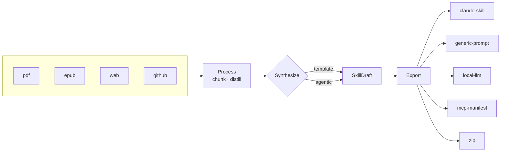

# Nested Documentation Implementation Plan

> **For agentic workers:** REQUIRED SUB-SKILL: Use superpowers:subagent-driven-development (recommended) or superpowers:executing-plans to implement this plan task-by-task. Steps use checkbox (`- [ ]`) syntax for tracking.

**Goal:** Replace the single 195-line reference README with a slim front door plus a nested `docs/` tree of essays and reference pages, guarded by a docs-consistency test.

**Architecture:** Plain markdown rendered by GitHub — no site generator, no build step. Pages are built leaves-first so every relative link resolves the moment it is written; `README.md` and `docs/index.md` land last because they link to everything. A single test (`tests/test_docs.py`) walks the tree and fails on broken links or on a provider, format, or command that no page mentions.

**Tech Stack:** Markdown, Mermaid (GitHub renders it natively), pytest, Typer CliRunner.

**Spec:** [2026-08-06-nested-documentation-design.md](../specs/2026-08-06-nested-documentation-design.md)

## Global Constraints

- **No source changes.** Only `README.md`, `docs/**`, and `tests/` may be touched. Nothing under `aptitude/` changes.
- **Voice split.** Essays (`why`, `product/perspective`, `product/roadmap`, `engineering/architecture`, `engineering/decisions`, `possible`) use the register in spec §8. Reference pages (`product/features`, `product/anatomy`, `engineering/extending`, `limitations`, `index`) stay plain.
- **Essay voice rules (spec §8):** short declarative sentences; concrete example before abstraction; admit what was wrong or surprising; no "powerful", "seamless", "revolutionize", no exclamation points; prose paragraphs not bullet stacks; numbered footnotes for asides; reasoning never roleplay — never write "as a Product Manager, I…".
- **Every factual claim must be true of the code as committed.** The verified facts are listed in the Reference Facts section below. Do not restate the v1 spec's promises as present-tense features.
- **Relative links only** between docs pages. The test rejects a link to a file that does not exist.
- **`docs/superpowers/`** is untouched and excluded from the link check.
- Providers: `claude`, `gemini`, `nvidia`, `ollama`, `openai`. Formats: `claude-skill`, `generic-prompt`, `local-llm`, `mcp-manifest`, `zip`. Synths: `template`, `agentic`. Commands: `create`, `providers`, `formats`, `validate`, `init`.

## Reference Facts

Every page draws from this list. Each was verified against the code, not the spec.

**Shape of the thing**
- ~1,371 lines of Python across `aptitude/`; 36 test files under `tests/`.
- CI matrix is Python 3.11–3.14 (`.github/workflows/tests.yml`).
- 5 providers × 5 formats × 2 synthesizers = 50 working combinations.
- Built between 2026-08-03 and 2026-08-04; commit history alternates `feat:` / `fix:` / `test:`, TDD throughout.

**Architecture**
- `SkillDraft` (`models.py`) is the pivot: every synthesizer produces one, every exporter consumes one. Providers and formats never reference each other.
- Each stage is an ABC plus a string-keyed registry (`registry.py`). Adding a provider, format, or adapter never edits `pipeline.py`.
- `pipeline.run()` is 25 lines (`pipeline.py:34-58`).
- `LLMProvider.chat()` defaults to a ReAct text protocol (`llm/tools_react.py`); each provider overrides it with native tool-calling. Tool support is therefore an optimization, not a requirement — the agent loop runs on models with no tool API.
- `AgenticSynthesizer` intercepts the *first* `finish` call, forces one self-critique, accepts the second. A `_critique_done` flag guarantees exactly one cycle.
- On non-convergence within `--max-iterations` (default 12), agentic falls back to `TemplateSynthesizer` and appends the fallback note to `provenance`.
- The agent has no filesystem and no network tools. `read_source` serves only already-ingested docs; `add_reference` accumulates in memory.
- One bad `--input` is skipped, not fatal. Exit codes: 0 ok, 1 partial, 2 fatal (`pipeline.py:42`, `cli.py:70`).

**Verified gaps** (spec §7 — these go in `limitations.md` and seed the roadmap)

| Gap | Evidence |
|---|---|
| No caching; web and GitHub refetch every run | `config.py:10` defines `"cache": ".aptitude-cache"`, nothing reads it; no `--no-cache` flag exists |
| Token counting is a heuristic everywhere | `process/tokens.py` is `return max(1, len(text) // 4)`; no tiktoken anywhere |
| `context_window` declared but unused | claude 200000, gemini 1000000, ollama 8000, openai 8000 — yet `distill()` sizes against the flat `--budget`, default 6000 |
| No retries or backoff | No occurrence of retry, backoff, or sleep in `aptitude/` |
| `SkillDraft.scripts` and `.tools` never populated | Neither synthesizer emits them, so `mcp-manifest` always exports an empty tool list and `scripts/` is always empty |
| `--base-url` is TOML-only | Read by the ollama and openai factories, never a CLI flag, never documented |
| `max_tokens_budget` is a dead config key | `DEFAULTS` defines it; `--budget` carries its own default and the key is never read |

---

### Task 1: Docs consistency test

Replaces the cwd-dependent, README-only assertion with a tree-wide guard. This lands first so every later task is verified as it commits.

**Files:**
- Create: `tests/test_docs.py`
- Delete: `tests/test_readme_examples.py`

**Interfaces:**
- Consumes: nothing.
- Produces: `pytest tests/test_docs.py` — the verification command every later task runs. Helper `_doc_paths() -> list[Path]` returns `README.md` plus every `docs/**/*.md` outside `docs/superpowers/`.

- [ ] **Step 1: Write the test**

Create `tests/test_docs.py`:

```python
import re
from pathlib import Path

import pytest
from typer.testing import CliRunner

from aptitude.cli import app  # importing the CLI registers every provider/format
from aptitude.config import DEFAULT_MODELS
from aptitude.export.base import export_registry

runner = CliRunner()

ROOT = Path(__file__).resolve().parent.parent
COMMANDS = ["create", "providers", "formats", "validate", "init"]
LINK = re.compile(r"\[[^\]]*\]\(([^)]+)\)")


def _doc_paths() -> list[Path]:
    """README plus every docs page, excluding the specs/plans archive."""
    paths = [ROOT / "README.md"]
    paths += sorted(p for p in (ROOT / "docs").rglob("*.md")
                    if "superpowers" not in p.relative_to(ROOT).parts)
    return [p for p in paths if p.exists()]


def _corpus() -> str:
    return "\n".join(p.read_text(encoding="utf-8") for p in _doc_paths())


def test_all_commands_have_help():
    for cmd in COMMANDS:
        assert runner.invoke(app, [cmd, "--help"]).exit_code == 0


@pytest.mark.parametrize("provider", sorted(DEFAULT_MODELS))
def test_docs_mention_every_provider(provider):
    assert provider in _corpus()


@pytest.mark.parametrize("fmt", sorted(export_registry.names()))
def test_docs_mention_every_format(fmt):
    assert fmt in _corpus()


@pytest.mark.parametrize("cmd", COMMANDS)
def test_docs_mention_every_command(cmd):
    assert cmd in _corpus()


def test_relative_links_resolve():
    broken = []
    for path in _doc_paths():
        for target in LINK.findall(path.read_text(encoding="utf-8")):
            target = target.split()[0]                      # drop optional "title"
            if target.startswith(("http://", "https://", "mailto:", "#")):
                continue
            rel = target.split("#")[0]                       # drop anchor
            if rel and not (path.parent / rel).exists():
                broken.append(f"{path.relative_to(ROOT)} -> {target}")
    assert not broken, "broken relative links: " + ", ".join(broken)
```

- [ ] **Step 2: Run the test — expect PASS**

Run: `python -m pytest tests/test_docs.py -q`
Expected: all pass. The current `README.md` already names every provider, format, and command, and its only relative links are to real files.

- [ ] **Step 3: Prove the link checker actually catches breakage**

Temporarily append to `README.md`:

```markdown
[deliberately broken](docs/does-not-exist.md)
```

Run: `python -m pytest tests/test_docs.py::test_relative_links_resolve -q`
Expected: FAIL with `broken relative links: README.md -> docs/does-not-exist.md`

A checker that has never failed is not known to work. This step is the red in the cycle.

- [ ] **Step 4: Remove the broken link and re-run**

Delete the line just added.
Run: `python -m pytest tests/test_docs.py -q`
Expected: PASS

- [ ] **Step 5: Delete the superseded test**

Remove `tests/test_readme_examples.py`. Its two assertions are now covered: `test_all_commands_have_help` is carried over verbatim, and the provider check is widened to the whole tree and to `DEFAULT_MODELS` rather than a hardcoded list.

Run: `python -m pytest -q`
Expected: full suite passes.

- [ ] **Step 6: Commit**

```bash
git add tests/test_docs.py tests/test_readme_examples.py
git commit -m "test: docs-wide link and coverage check, replacing README-only assertion"
```

---

### Task 2: The features reference

The single home for flag-level detail. Everything the current README documents moves here, corrected and extended. Later tasks link here rather than restating.

**Files:**
- Create: `docs/product/features.md`

**Interfaces:**
- Consumes: `tests/test_docs.py` from Task 1.
- Produces: the canonical anchors later pages link to — `#providers`, `#output-formats`, `#synthesizers`, `#configuration`, `#commands`.

- [ ] **Step 1: Write the page**

Title: `# What Aptitude Does`. Reference voice — plain, tabular, no essay register.

Required sections, in order:

1. **Intro** — two sentences. Aptitude turns a prompt plus artifacts into a skill. Then a one-line pipeline sketch: `Ingest → Process → Synthesize → Export`, linking `Ingest → Process → Synthesize → Export` to [../engineering/architecture.md](../engineering/architecture.md).
2. **Inputs** — the four ingestion adapters (`pdf`, `epub`, `web`, `github`), what each extracts, and how `--type auto` detects them. State that `--type` forces the type for **all** `-i` inputs in a run, not just the preceding one.
3. **Providers** — the five-row table from the current README (provider, env var, default model), plus the default-resolution rule: `claude` if `ANTHROPIC_API_KEY` is set, else `ollama`. Add a note that `nvidia` and `openai` share one OpenAI-compatible implementation, and that `--base-url` is settable in `aptitude.toml` but is not a CLI flag — link that caveat to [../limitations.md](../limitations.md).
4. **Output formats** — the five-row table from the current README. For `mcp-manifest`, state plainly that no synthesizer currently populates `SkillDraft.tools`, so the manifest ships with an empty tool list; link to [../limitations.md](../limitations.md).
5. **Synthesizers** — the `template` vs `agentic` table from the current README, the `--synth` and `--max-iterations` flags, the forced self-critique, and the fallback-to-template behaviour with its `provenance` note.
6. **Cost and latency** — new. `template` is a fixed 3 provider calls. `agentic` is up to `--max-iterations` (default 12) chat turns plus one forced critique round, and may then still fall back to template's 3. `--dry-run` stops after distillation but is not free: a corpus over `--budget` is summarized by the provider first. Recommend `--provider ollama` for a zero-cost preview.
7. **Configuration** — the four-level precedence chain (CLI > env > `aptitude.toml` > default) and the example TOML, both from the current README.
8. **Commands** — `create`, `providers`, `formats`, `validate`, `init` with their options, carried over from the current README.

- [ ] **Step 2: Verify**

Run: `python -m pytest tests/test_docs.py -q`
Expected: PASS. Links to `../limitations.md` and `../engineering/architecture.md` will fail until Tasks 3 and 4 land — so write this page's links but expect `test_relative_links_resolve` to fail until then, **or** add the links in Task 8 during the final pass. Prefer the latter: leave the link text plain here and convert to links in Task 8, keeping the tree green at every commit.

- [ ] **Step 3: Commit**

```bash
git add docs/product/features.md
git commit -m "docs: features reference"
```

---

### Task 3: Output anatomy and limitations

Two reference leaves. `anatomy.md` answers a question nothing in the repo currently answers: what does the generated thing actually look like? `limitations.md` is the candor page.

**Files:**
- Create: `docs/product/anatomy.md`
- Create: `docs/limitations.md`

**Interfaces:**
- Consumes: Task 1's test.
- Produces: `docs/limitations.md` anchors that `roadmap.md` (Task 6) links to — one `##` heading per gap.

- [ ] **Step 1: Generate a real skill to document**

Do not invent the output. Produce one:

```bash
python -m aptitude create -p "Skill for writing conventional commit messages" -i README.md --provider ollama --format all --out ./out
```

If no Ollama server is reachable, construct the example from the exporters directly — `export/claude_skill.py`, `export/generic_prompt.py`, `export/local_llm.py`, `export/mcp_manifest.py` — and say in the page that the sample is illustrative. Delete `./out` before committing; it is not checked in.

- [ ] **Step 2: Write `docs/product/anatomy.md`**

Title: `# Anatomy of a Generated Skill`. Reference voice.

Required sections:
1. **The directory** — a fenced tree of `out/<skill-name>/` showing the flat layout, with a comment on each file naming which exporter wrote it.
2. **SKILL.md** — a real annotated example. Call out the YAML frontmatter and the three rules the validator enforces (`validate/validator.py`): name must match `^[a-z0-9]+(-[a-z0-9]+)*$` and be ≤64 chars, description must be non-empty and ≤1024 chars. Note the warning for a body under 40 chars.
3. **references/** — what the agentic synthesizer's `add_reference` writes here, and that the template synthesizer distils them instead.
4. **The other formats** — one short subsection each for `generic-prompt`, `local-llm`, `mcp-manifest`, `zip`: what file it emits and the one situation where you would pick it.
5. **Checking a skill** — `aptitude validate ./out/<skill-name>`, and the exit codes (0 valid, 2 invalid).

- [ ] **Step 3: Write `docs/limitations.md`**

Title: `# What It Doesn't Do Yet`. Reference voice, but lead with two sentences of plain framing: these are places where the v1 design spec promised something the code does not do, listed so a reader does not have to find them by being surprised.

One `##` section per row of the Reference Facts gap table. Each section states the gap in one sentence, names the evidence (file and line), and says what it costs the user in practice. Be concrete about consequences:

- **No caching** — re-running against the same GitHub repo or URL refetches it every time. Slow and, for rate-limited hosts, occasionally fatal.
- **Token counting is a heuristic** — `len(text) // 4`. Fine for English prose, wrong for code and CJK, so `--budget` is approximate in exactly the cases where budgets matter most.
- **`context_window` is declared but unused** — Gemini advertises a million-token window and gets sized against the same default 6000-token budget as everything else. Large-context providers currently buy you nothing.
- **No retries** — one transient 503 ends the run after ingestion has already been paid for.
- **`scripts` and `tools` are never populated** — `mcp-manifest` therefore emits an empty tool list, and no generated skill ships executable scripts. The format works; there is just nothing yet to put in it.
- **`--base-url` is TOML-only** — pointing at LM Studio or vLLM works, but only via `aptitude.toml`.
- **`max_tokens_budget` is dead config** — it looks like a knob and is not one. Use `--budget`.

Close with a sentence pointing to the roadmap. Leave it as plain text; Task 8 converts it to a link.

- [ ] **Step 4: Verify**

Run: `python -m pytest tests/test_docs.py -q`
Expected: PASS.

- [ ] **Step 5: Commit**

```bash
git add docs/product/anatomy.md docs/limitations.md
git commit -m "docs: skill anatomy and verified limitations"
```

---

### Task 4: The architect's view and the extension guide

**Files:**
- Create: `docs/engineering/architecture.md`
- Create: `docs/engineering/extending.md`

**Interfaces:**
- Consumes: Task 1's test.
- Produces: `docs/engineering/architecture.md#the-pivot` — the anchor `decisions.md` (Task 5) links to.

- [ ] **Step 1: Write `docs/engineering/architecture.md`**

Title: `# The Architect's View`. **Essay voice.**

The argument, in order:

1. **Open on the number.** Five providers, five formats, two synthesizers — fifty working combinations, from about 1,371 lines. That ratio is the whole design, and it comes from one decision.
2. **The pivot** (`## The pivot`). `SkillDraft` sits in the middle. Synthesizers produce it; exporters consume it. No provider has ever heard of an exporter. Adding a sixth provider adds five combinations and costs one file. Include a mermaid diagram:



3. **Registries** (`## Registries, not conditionals`). Each stage is an ABC plus a string-keyed registry. `pipeline.run()` is 25 lines and has never been edited to add a component. Show the four-line shape of registering an exporter.
4. **The ReAct default** (`## Tool-calling as an optimization`). This is the second interesting decision and deserves the most space. `LLMProvider.chat()` has a default implementation that renders the tool catalog into plain text and parses a fenced action block back out. Providers override it with native tool-calling where they have it. The consequence: the agent loop runs on a model with no tool API at all. Native support became a speed and reliability upgrade rather than a gate. Note that this is also what lets `FakeProvider` drive the entire agent loop in tests with no network.
5. **Designing for the failure** (`## What happens when the agent doesn't converge`). Bound the loop at `--max-iterations`, then fall back to template and record it in `provenance`. Also: a malformed tool call is returned to the agent as a tool error rather than crashing the loop, so the model gets to correct itself on its own budget.
6. **Where the seams are** (`## Seams`). One paragraph, ending in a link to `extending.md` (leave plain; Task 8 links it).
7. **What I would do differently.** Required — the essay is not honest without it. The gaps in [limitations.md](../limitations.md) are not all oversights: `context_window` was implemented on every provider and then never consulted by the pipeline, which is a design mistake rather than missing work. Say so.

- [ ] **Step 2: Write `docs/engineering/extending.md`**

Title: `# Adding a Provider, Format, or Adapter`. Reference voice.

Three walkthroughs. Each shows the ABC being implemented, the registry call, the contract test the component must pass, and the one-line CLI import that registers it (`cli.py:10-14`).

1. **A new provider** — subclass `LLMProvider`, implement `generate()`, declare `context_window`; optionally override `chat()` for native tools, and note that skipping it means inheriting the working ReAct default. Point at `tests/llm_contract.py`. Note that OpenAI-compatible endpoints usually need only a base URL and a default model.
2. **A new exporter** — implement `Exporter.export(draft, out_dir) -> list[Path]`, register it, and pass `tests/export_contract.py`.
3. **A new ingestion adapter** — implement `IngestionAdapter.ingest(Source) -> Document`, register it, extend `detect_kind()`, and add a fixture under `tests/fixtures/`.

Close with the house rules: tests are offline and deterministic; live provider calls sit behind `@pytest.mark.live` and are deselected by default (`pyproject.toml`).

- [ ] **Step 3: Verify**

Run: `python -m pytest tests/test_docs.py -q`
Expected: PASS.

- [ ] **Step 4: Check the mermaid renders**

Paste the diagram block into any GitHub markdown preview, or push the branch and view the file. A syntax error renders as a raw code block, which is the failure mode to catch.

- [ ] **Step 5: Commit**

```bash
git add docs/engineering/architecture.md docs/engineering/extending.md
git commit -m "docs: architect's view and extension guide"
```

---

### Task 5: Why it exists, and the decisions

The two essays that carry the most weight for a reader judging the work.

**Files:**
- Create: `docs/why.md`
- Create: `docs/engineering/decisions.md`

**Interfaces:**
- Consumes: Task 4's architecture page (referenced by name; linked in Task 8).
- Produces: nothing later tasks depend on structurally.

- [ ] **Step 1: Write `docs/why.md`**

Title: `# Why Aptitude Exists`. **Essay voice.** Target 500–800 words.

The argument: skills became the unit of reuse for agents. But the knowledge that belongs in a skill almost always already exists — in a PDF, a repo, a docs site, an RFC. Nobody is short of knowledge. What they are short of is the *shape*: an agent cannot act on a 300-page standard, it needs the twelve rules that standard implies, in the form its runtime expects.

Turning the first into the second is real work, and it is mostly mechanical. Read the source, decide what matters for this purpose, compress it, and emit it in the right format. Mechanical work that requires judgment is exactly what LLMs are for.

End on the consequence: if reshaping is cheap, you stop hoarding skills and start generating them per task. A skill becomes something you make for an afternoon's work rather than a thing you maintain.

- [ ] **Step 2: Write `docs/engineering/decisions.md`**

Title: `# Key Decisions`. **Essay voice**, but structured — one `##` per decision, each with three labelled parts: **The call**, **What was rejected**, **What would change my mind**. The third part is mandatory on every entry; it is the only part that stays useful.

The seven decisions:

1. **A pluggable pipeline, not a monolith.** Rejected: a single orchestrator, faster to start. Changes my mind: if the component count had stayed at two providers and one format, the abstractions would have cost more than they saved.
2. **`SkillDraft` as the pivot.** Rejected: letting exporters read provider output directly. Changes my mind: a format that needs something the draft cannot represent — a skill that must carry binaries, say.
3. **Template synthesis first; agentic deferred to V2.** Rejected: building the interesting version first. Changes my mind: nothing, in hindsight — this is the decision I would repeat most confidently, and the reasoning is expanded in the product view. (Plain text here — `perspective.md` does not exist until Task 6; Task 8 converts this to a link.)
4. **ReAct as the default, native tool-calling as an override.** Rejected: requiring native tool support, which would have excluded most local models. Changes my mind: if every target provider gained reliable native tools, the text protocol becomes dead weight.
5. **Agentic falls back to template instead of failing.** Rejected: raising `SynthesisError`. The user paid for ingestion already; handing them nothing is the worst outcome. Changes my mind: if silent fallback ever hid a systematic failure — which is why the fallback is recorded in `provenance` rather than being invisible.
6. **No filesystem or network tools for the agent.** Rejected: letting the agent fetch what it decides it needs. Changes my mind: very little. The blast radius of an LLM with a file tool is not worth the convenience.
7. **Exactly one forced self-critique.** Rejected both: zero (drafts were visibly weaker) and unbounded (cost grows, quality plateaus). Changes my mind: evidence from actual scoring, which does not exist yet — see the roadmap.

Note in the intro that decision 3's reasoning is expanded in the product view, and 4 and 5 in the architecture page. Leave those as plain text; Task 8 links them.

- [ ] **Step 3: Verify**

Run: `python -m pytest tests/test_docs.py -q`
Expected: PASS.

- [ ] **Step 4: Commit**

```bash
git add docs/why.md docs/engineering/decisions.md
git commit -m "docs: why Aptitude exists, and the key decisions"
```

---

### Task 6: The product view and the roadmap

**Files:**
- Create: `docs/product/perspective.md`
- Create: `docs/product/roadmap.md`

**Interfaces:**
- Consumes: `docs/limitations.md` from Task 3 — every near-term roadmap item cites a gap documented there.
- Produces: nothing later tasks depend on structurally.

- [ ] **Step 1: Write `docs/product/perspective.md`**

Title: `# The Product Manager's View`. **Essay voice.** Target 600–900 words. Reasoning, not persona — do not write "as a PM".

The argument: the v1 design spec explicitly deferred agentic synthesis and shipped a fixed three-call template instead. Listed as a non-goal, in writing, on day one. That reads like timidity. It was the plan.

Two reasons. First, the boring version proved the pipeline: by the time the interesting version was worth building, ingestion, chunking, distillation, validation, and five exporters were all working and tested, so the agent loop only had to be *an agent loop*. Second, the spec reserved the seam — §11 named the extension point and the exact toolset before any of it was built. When V2 arrived a day later it plugged into a socket that was already there, and `pipeline.py` did not change.

Then the harder question: `template` is still the default after `agentic` shipped. Argue it. Template is 3 calls, deterministic, and works on every provider including ones with no tool support. Agentic is up to 12 turns plus a critique round, and on a weak model it may spend all of that and fall back to template anyway. The default should be the one that works for someone who has not read the docs.

Close on what is actually missing: there is no measurement. Nothing scores a generated skill, so "agentic produces better skills" is a claim resting on inspection, not evidence. That is the roadmap's most important item and the reason decision 7 in [the decisions page](../engineering/decisions.md) cannot be settled.

- [ ] **Step 2: Write `docs/product/roadmap.md`**

Title: `# Where This Goes`. **Essay voice** for the framing paragraphs, table for the items.

Open with the rule that makes the roadmap credible: every near-term item is a gap that already exists in the code, not a feature someone wished for. Link the reader to `limitations.md` for the evidence (plain text; Task 8 links it).

Three horizons:

**Near — close the gaps.** Each row cites its limitation.
| Item | Why |
|---|---|
| Disk cache for web and GitHub, plus `--no-cache` | `config.py` already reserves the key; re-runs currently refetch |
| Real token counting | `len(text) // 4` makes `--budget` a guess on code and CJK |
| Derive the budget from `provider.context_window` | Every provider declares one; the pipeline ignores all of them |
| Bounded retries with backoff | One transient 503 currently discards completed ingestion work |
| `--base-url` as a CLI flag | Already wired through the factories, just unreachable |
| Delete `max_tokens_budget` | Dead config that reads like a knob |

**Mid — make generated skills verifiable.** The theme, not a checklist: scoring a generated skill, then generate → score → regenerate. This is what turns "agentic is better" into a measurable claim and lets the critique count be tuned on evidence. Also here: `search_sources` as a keyword index for the agent (named as a possible future addition in the V2 spec's non-goals), and widening the intake — docx, Notion, YouTube transcripts — each of which is one `IngestionAdapter`.

**Far — skills that do things.** `SkillDraft` already has `scripts` and `tools` fields that nothing populates. Filling them means generated skills could carry executable helpers and a real MCP manifest. Plus a plugin export that installs straight into Claude Code rather than emitting a directory to copy.

Close with one honest paragraph on what is deliberately *not* planned: a web UI, a hosted service, deep crawling, and automated publishing into a live environment — all v1 non-goals that remain non-goals.

- [ ] **Step 3: Verify**

Run: `python -m pytest tests/test_docs.py -q`
Expected: PASS.

- [ ] **Step 4: Commit**

```bash
git add docs/product/perspective.md docs/product/roadmap.md
git commit -m "docs: product view and roadmap"
```

---

### Task 7: The art of the possible

**Files:**
- Create: `docs/possible.md`

**Interfaces:**
- Consumes: `docs/product/features.md` for flag syntax — every command shown must be valid against `cli.py`.
- Produces: nothing.

- [ ] **Step 1: Write the page**

Title: `# The Art of the Possible`. **Essay voice** for the framing, real commands for the recipes.

Open with the reframe: Aptitude looks like a document converter, and the interesting uses are the ones where the source is not documentation.

**Recipes that work today.** Four, each with a runnable command and a sentence on why the output is useful. Every flag must exist in `cli.py`.

1. **A spec becomes a reviewer.** Feed a design doc, get a skill that reviews PRs against it.
2. **A repo becomes an onboarding guide.** `-i github.com/org/repo` — the GitHub adapter extracts README, docs, and code structure, which is roughly what a new hire reads first.
3. **A standard becomes a linter.** A long compliance PDF becomes the dozen rules it actually implies.
4. **Many sources become one skill.** Multiple `-i` flags mixing a PDF, a repo, and a URL — distillation merges them with provenance intact, which is the thing that is genuinely tedious by hand.

**Then the honest speculation.** Clearly marked as not-yet-possible. The recursive one is the good ending: Aptitude generating skills for the agent that runs Aptitude — point at the fact that this repo's own specs and plans in `docs/superpowers/` are exactly the kind of artifact Aptitude ingests, so the loop is short. Note plainly that this needs the evaluation work in the roadmap before it is more than a party trick.

- [ ] **Step 2: Verify every command in the page is valid**

For each fenced command, check the flags against `aptitude/cli.py:24-36`. Then:

Run: `python -m aptitude create --help`
Confirm every flag used on the page appears.

- [ ] **Step 3: Verify docs**

Run: `python -m pytest tests/test_docs.py -q`
Expected: PASS.

- [ ] **Step 4: Commit**

```bash
git add docs/possible.md
git commit -m "docs: the art of the possible"
```

---

### Task 8: The front door, the map, and the cross-links

Lands last because everything it links to now exists. This is also where the deferred links from Tasks 2–6 get converted.

**Files:**
- Create: `docs/index.md`
- Modify: `README.md` (full rewrite, 195 lines → under 120)
- Modify: `docs/product/features.md`, `docs/limitations.md`, `docs/engineering/architecture.md`, `docs/engineering/decisions.md`, `docs/product/perspective.md`, `docs/product/roadmap.md` — convert deferred plain-text references into relative links.

**Interfaces:**
- Consumes: every page from Tasks 2–7.
- Produces: the finished tree.

- [ ] **Step 1: Write `docs/index.md`**

Title: `# Aptitude Documentation`. Reference voice. A routing table — one row per page, with who it is for:

| Page | For |
|---|---|
| [Why Aptitude Exists](why.md) | Understanding the problem it solves |
| [What It Does](product/features.md) | Commands, providers, formats, configuration |
| [Anatomy of a Generated Skill](product/anatomy.md) | What the output actually looks like |
| [The Product Manager's View](product/perspective.md) | Why it was sequenced this way |
| [Where This Goes](product/roadmap.md) | What is planned, and what is not |
| [The Architect's View](engineering/architecture.md) | How 50 combinations fit in 1,400 lines |
| [Key Decisions](engineering/decisions.md) | What was chosen, rejected, and what would change it |
| [Adding a Provider, Format, or Adapter](engineering/extending.md) | Contributing |
| [The Art of the Possible](possible.md) | Recipes and speculation |
| [What It Doesn't Do Yet](limitations.md) | Known gaps, with evidence |

Close with a line pointing to `superpowers/specs/` and `superpowers/plans/` as the archive of design docs, described as historical rather than current — note that where a spec and the code disagree, `limitations.md` is the reconciliation.

- [ ] **Step 2: Rewrite `README.md`**

Under 120 lines. Sections, in order:

1. Title, CI badge (keep the existing one), and the one-line description.
2. **Two sentences** on what Aptitude is.
3. **Install** — `pip install -e ".[dev]"` and the `start.sh` / `start.ps1` launcher note, both carried over.
4. **One worked example** — a single `aptitude create` invocation followed by the actual `out/<skill-name>/` tree it produces. Show output; a README that only shows input makes the reader guess.
5. **Providers** and **Output formats** — keep both tables here. They answer "can I use this?" and belong on the front page. Each table ends with a link to [docs/product/features.md](docs/product/features.md) for the full detail.
6. **Documentation** — the routing table, mirroring `docs/index.md` but abbreviated to one line per destination. This is the last thing on the page.

Everything else — synthesizers, configuration precedence, per-command options, examples 2 and 3 — moves to `docs/product/features.md` and is deleted from the README.

- [ ] **Step 3: Convert the deferred links**

In each file listed under **Files**, replace the plain-text references left by earlier tasks with real relative links. Get the depth right: pages in `docs/product/` and `docs/engineering/` reach siblings with `../`, and `README.md` reaches everything with `docs/`.

- [ ] **Step 4: Verify the whole tree**

Run: `python -m pytest tests/test_docs.py -q`
Expected: PASS — in particular `test_relative_links_resolve` now covers every cross-link in the tree.

Run: `python -m pytest -q`
Expected: full suite passes.

- [ ] **Step 5: Check the README length**

Run: `python -c "print(sum(1 for _ in open('README.md', encoding='utf-8')))"`
Expected: under 120.

- [ ] **Step 6: Read the tree as a stranger**

Start at `README.md` and follow each routing link once. Check: does every page open by saying who it is for? Does any two pages state the same fact differently? Flag-level detail should exist only in `features.md`.

- [ ] **Step 7: Commit**

```bash
git add README.md docs/
git commit -m "docs: slim README front door and docs index, wire cross-links"
```

---

## Self-Review

**Spec coverage.** Every section of the design spec maps to a task: §5 structure → Tasks 2–8 (all eleven files created); §6 page contracts → one task step per page; §7 verified gaps → Task 3 (`limitations.md`) and Task 6 (roadmap rows citing them); §8 voice → Global Constraints, applied per-page; §9 testing → Task 1; §10 risks → mitigated by Task 8 step 6 (drift check) and Task 1 (link rot).

**Placeholder scan.** No TBD or TODO. Each docs step names the exact headings, the required facts, and the target length where it matters. Task 1 carries complete, runnable test code.

**Type consistency.** `_doc_paths()` and `_corpus()` are defined once in Task 1 and referenced by name thereafter. Format, provider, and command names are fixed in Global Constraints and match the registries. The verification command is `python -m pytest tests/test_docs.py -q` in every task.

**One deliberate ordering constraint.** Tasks 2–6 write cross-references as plain text and Task 8 converts them to links. This keeps `test_relative_links_resolve` green at every commit rather than red for six commits. Task 2 step 2 states this explicitly; the same rule applies to the links flagged in Tasks 3, 4, 5, and 6.
